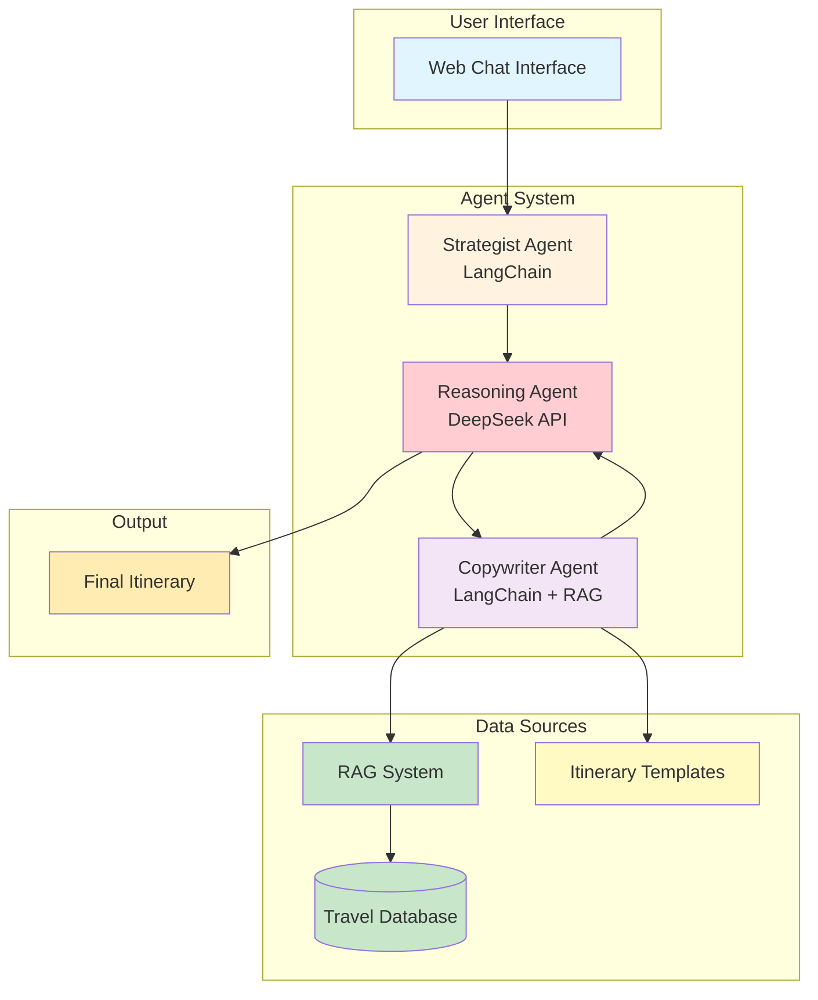
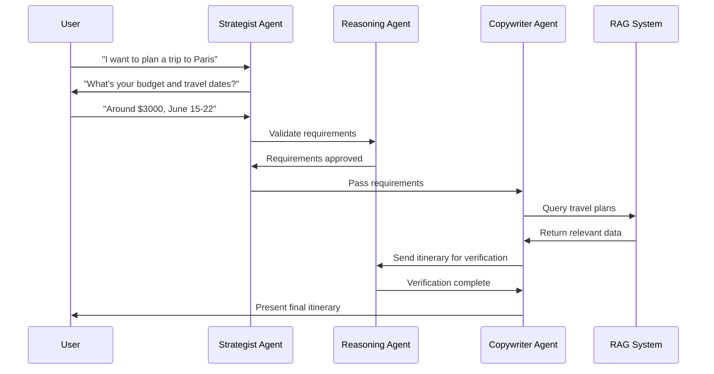

# Multi-Agent Travel Itinerary System

## Three-Agent Architecture

## Agent Workflow

## Three Agents

### 1. **Strategist Agent (LangChain)**
- Collects user requirements (destination, dates, budget, interests)
- Manages conversation flow and validation
- Passes complete requirements to Reasoning Agent

### 2. **Copywriter Agent (LangChain + RAG)**
- Queries company database via RAG system
- Uses itinerary templates and company data
- Creates personalized day-by-day itineraries
- Sends to Reasoning Agent for verification

### 3. **Reasoning Agent (DeepSeek API)**
- Validates user requirements for consistency
- Verifies itinerary matches all requirements
- Checks budget, dates, and logical flow
- Provides final approval or revision requests

## Key Components

### 1. **RAG System**
- Searches company's travel database
- Finds relevant travel plans and offers
- Provides context for itinerary generation

### 2. **Travel Database**
- Stores company's travel packages
- Contains pricing, activities, accommodations
- Includes special offers and deals

### 3. **Output**
- Personalized travel itinerary
- Day-by-day schedule
- Budget breakdown
- Activity recommendations 