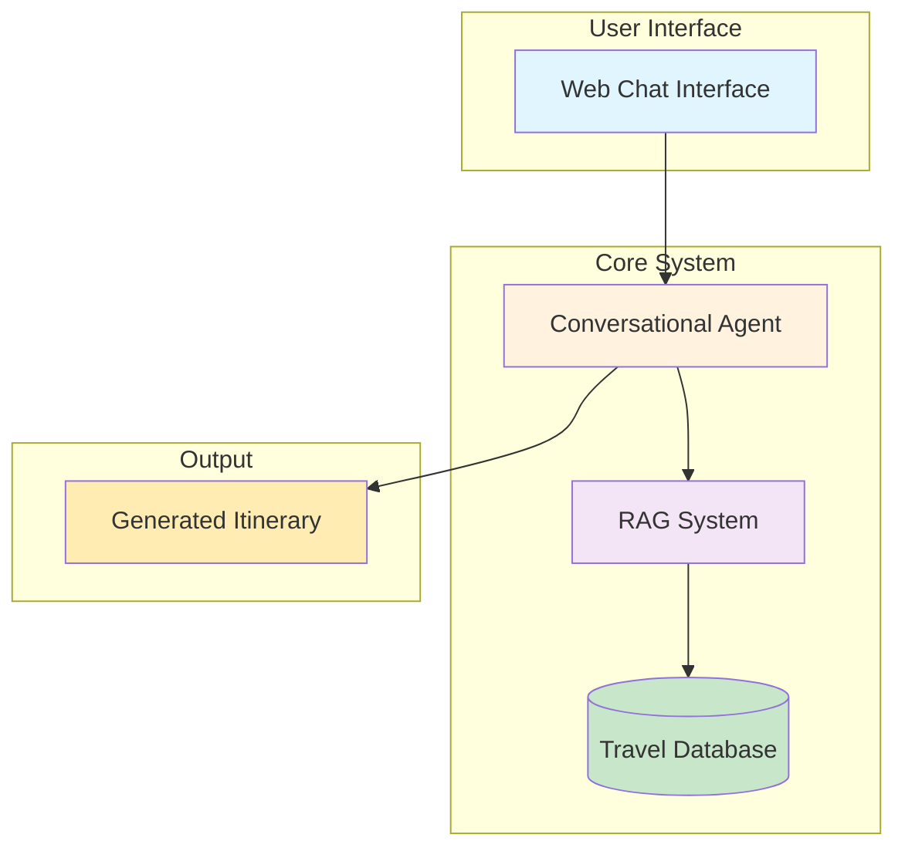
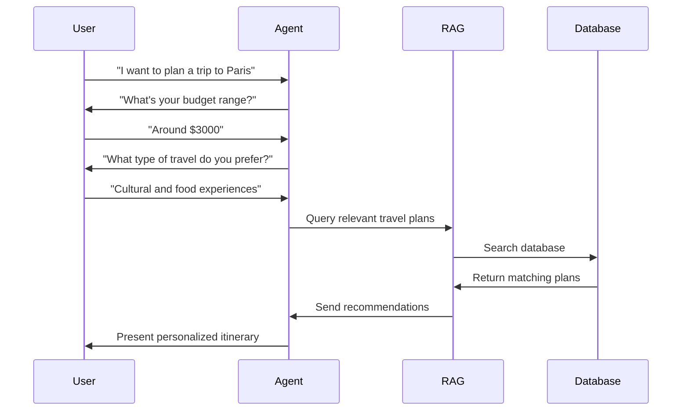

# Travel Itinerary Generation System - Simplified Workflow

## High-Level System Architecture

## Simple Workflow Process

## Key Components

### 1. **Conversational Agent**
- Collects user preferences (destination, budget, interests)
- Manages conversation flow
- Generates final itinerary

### 2. **RAG System**
- Searches company's travel database
- Finds relevant travel plans and offers
- Provides context for itinerary generation

### 3. **Travel Database**
- Stores company's travel packages
- Contains pricing, activities, accommodations
- Includes special offers and deals

### 4. **Output**
- Personalized travel itinerary
- Day-by-day schedule
- Budget breakdown
- Activity recommendations 