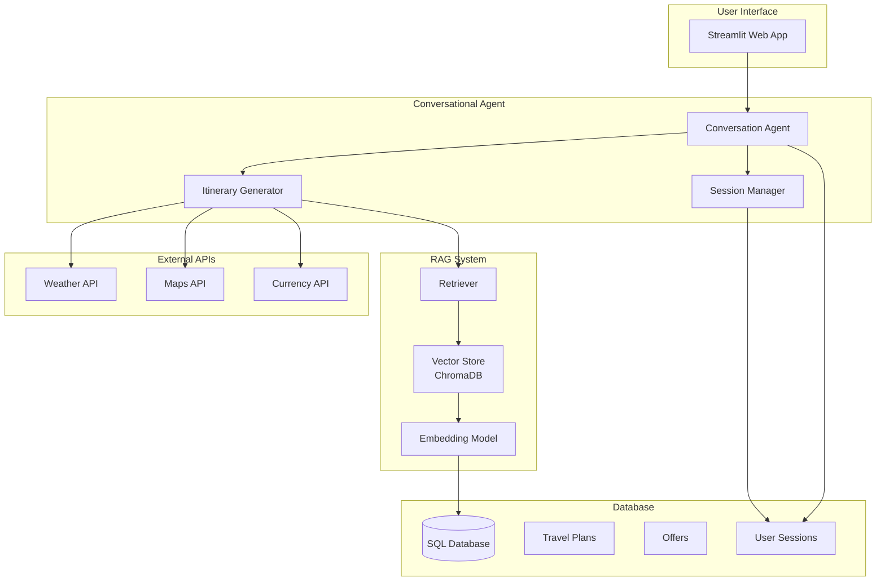
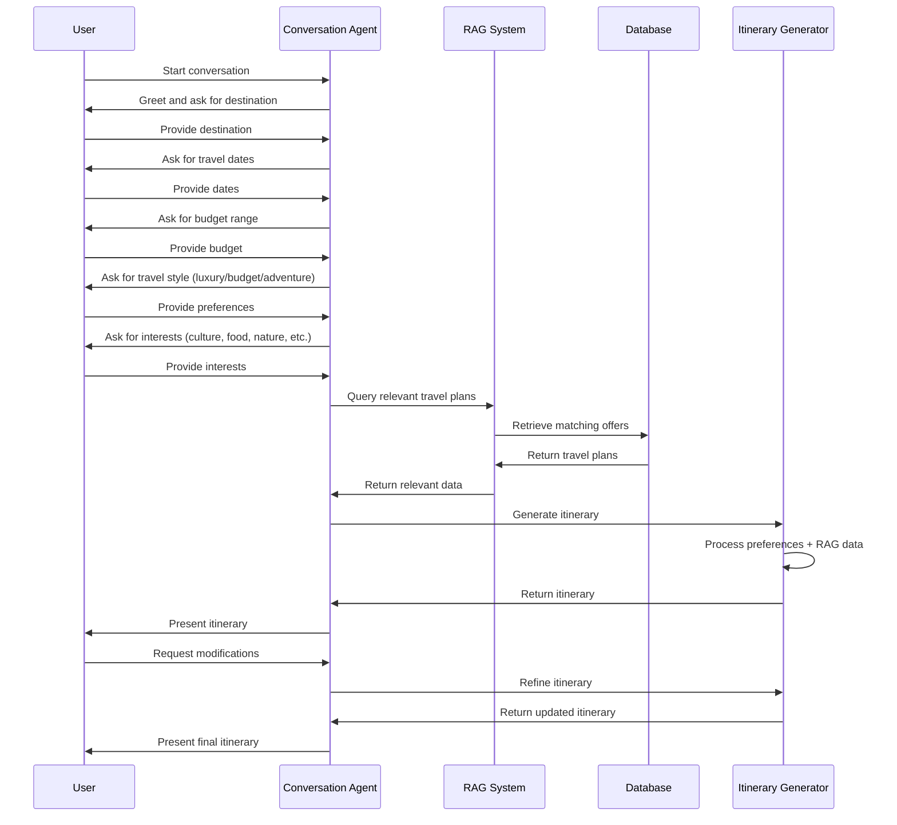
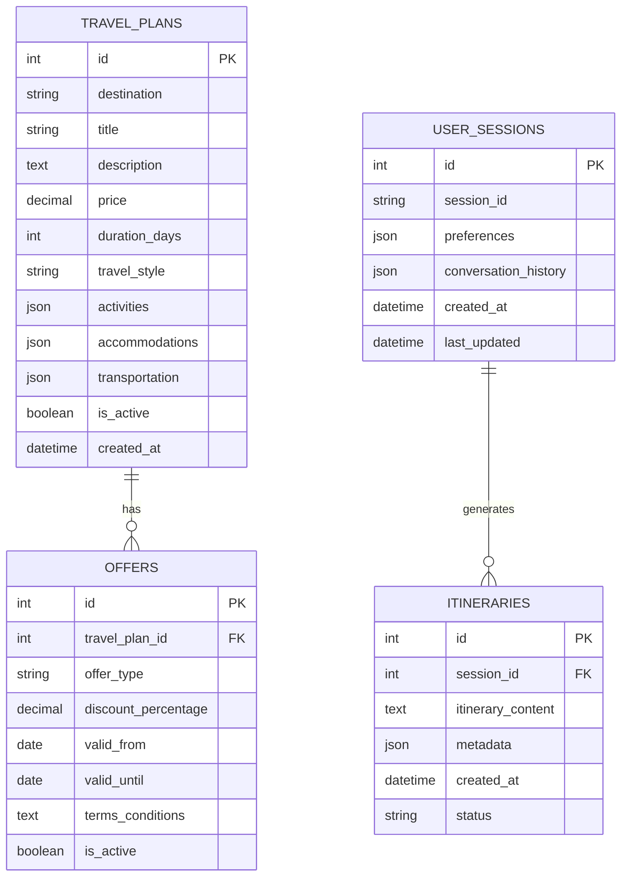

# Travel Itinerary Generation Workflow

## System Architecture Diagram

## Detailed Workflow Process

## Data Flow Diagram

```mermaid
flowchart LR
    subgraph "Input Processing"
        A[User Input] --> B[Intent Recognition]
        B --> C[Entity Extraction]
        C --> D[Preference Collection]
    end
    
    subgraph "RAG Processing"
        D --> E[Query Formation]
        E --> F[Vector Search]
        F --> G[Relevant Data Retrieval]
    end
    
    subgraph "Itinerary Generation"
        G --> H[Data Integration]
        H --> I[Constraint Satisfaction]
        I --> J[Itinerary Creation]
    end
    
    subgraph "Output"
        J --> K[Formatted Itinerary]
        K --> L[User Presentation]
    end
    
    style A fill:#e1f5fe
    style L fill:#c8e6c9
    style G fill:#fff3e0
    style J fill:#f3e5f5
```

## Database Schema

## Key Components Description

### 1. Conversation Agent
- **Purpose**: Manages natural language interaction with users
- **Functions**: 
  - Intent recognition and entity extraction
  - Progressive preference collection
  - Context maintenance across conversation
  - Itinerary presentation and refinement

### 2. RAG System
- **Purpose**: Retrieves relevant travel information from company database
- **Components**:
  - Vector store (ChromaDB) for semantic search
  - Embedding model for text vectorization
  - Retriever for relevant document fetching
  - Query processing and ranking

### 3. Itinerary Generator
- **Purpose**: Creates personalized travel itineraries
- **Process**:
  - Integrates user preferences with retrieved data
  - Applies business rules and constraints
  - Generates day-by-day itinerary
  - Handles budget optimization

### 4. Database Layer
- **Purpose**: Stores company's travel plans, offers, and user data
- **Tables**:
  - Travel Plans: Company's travel packages
  - Offers: Special deals and promotions
  - User Sessions: Conversation state management
  - Itineraries: Generated travel plans

## Implementation Notes

1. **Vector Embeddings**: Use sentence-transformers for travel plan embeddings
2. **Conversation State**: Maintain session state for multi-turn conversations
3. **Budget Optimization**: Implement constraint satisfaction for budget-aware recommendations
4. **Real-time Updates**: Integrate with external APIs for current pricing and availability
5. **Personalization**: Use collaborative filtering for similar user recommendations 